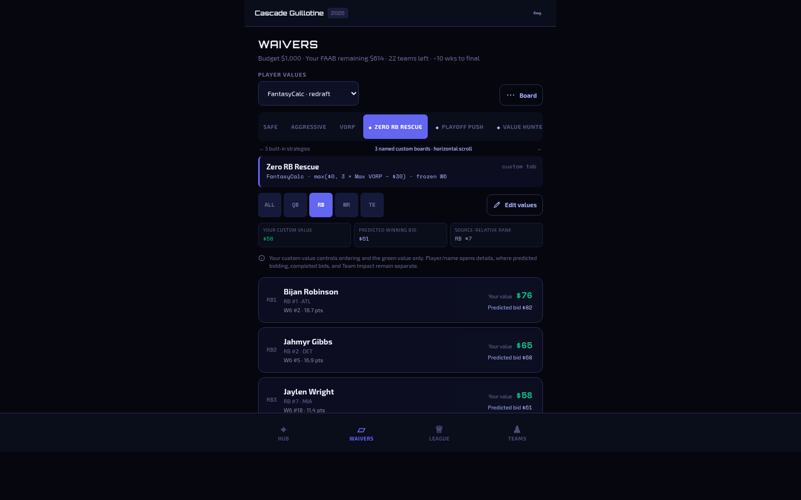
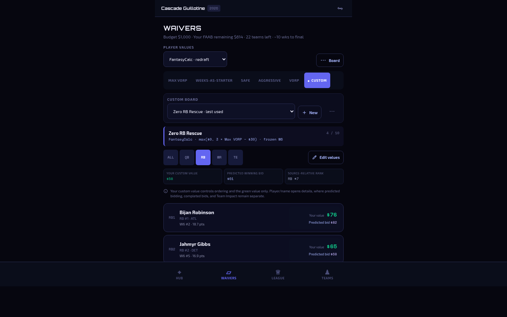
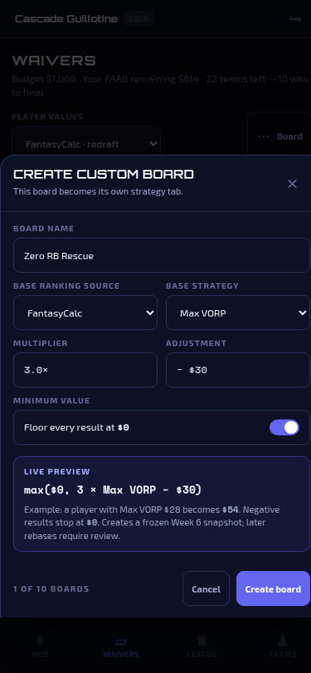
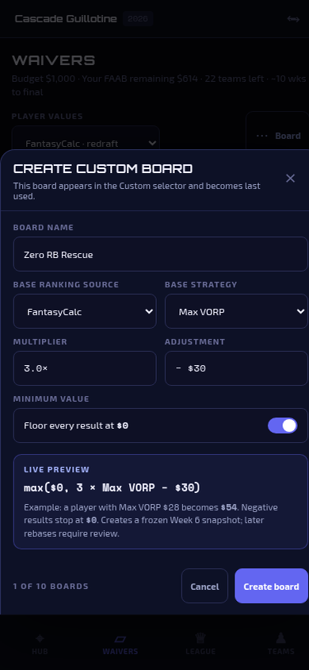

# Custom ranking/value-board UX mockups

Design-only review package for Guillotine Companion. It compares:

1. **Option 3:** every newly created named custom board becomes its own strategy tab.
2. **Hybrid:** one final `Custom` strategy tab, then a named-board selector and `+ New` inside it.

**Recommendation:** Hybrid. See [COMPARISON.md](./COMPARISON.md) for the balanced trade-off analysis.

No product source, API, workflow, package, runtime behavior, or deployment configuration is changed by this package.

## Interactive prototype

The prototype is static HTML/CSS/JS with no build step.

```bash
cd docs/design/custom-ranking-boards
python3 -m http.server 4173 --bind 127.0.0.1
```

Open these exact local links:

- **Review controller:** <http://127.0.0.1:4173/>
- **Option 3 / browse:** <http://127.0.0.1:4173/?alt=option3&state=browse>
- **Option 3 / edit + slot reorder:** <http://127.0.0.1:4173/?alt=option3&state=edit>
- **Option 3 / create:** <http://127.0.0.1:4173/?alt=option3&state=create>
- **Hybrid / browse:** <http://127.0.0.1:4173/?alt=hybrid&state=browse>
- **Hybrid / edit + slot reorder:** <http://127.0.0.1:4173/?alt=hybrid&state=edit>
- **Hybrid / create:** <http://127.0.0.1:4173/?alt=hybrid&state=create>

The state picker also exposes `Delete confirmation`, `Unsaved changes`, `Empty state`, and `Maximum 10 boards`. The URL is shareable: use `alt=option3|hybrid` and `state=browse|edit|create|delete|unsaved|empty|max10`.

> GitHub does not execute repository HTML. Review the PNGs below directly on GitHub, or serve `index.html` locally with the command above.

## Screenshot index

All screenshots are captured from the prototype at **1440×900 desktop** or **390×844 mobile**.

### Option 3 — board-per-strategy-tab

| View | Desktop | Mobile |
|---|---|---|
| Browse / selected board | [PNG](./screenshots/option3-desktop-browse.png) | [PNG](./screenshots/option3-mobile-browse.png) |
| Edit + slot-preserving reorder | [PNG](./screenshots/option3-desktop-edit-reorder.png) | [PNG](./screenshots/option3-mobile-edit-reorder.png) |
| Create board dialog / sheet | [PNG](./screenshots/option3-desktop-create-dialog.png) | [PNG](./screenshots/option3-mobile-create-sheet.png) |
| Ten-board cap | [PNG](./screenshots/option3-desktop-max10.png) | — |
| Empty state | — | [PNG](./screenshots/option3-mobile-empty.png) |
| Unsaved-change protection | — | [PNG](./screenshots/option3-mobile-unsaved-changes.png) |

### Hybrid — Custom tab + named-board selector

| View | Desktop | Mobile |
|---|---|---|
| Browse / selected board | [PNG](./screenshots/hybrid-desktop-browse.png) | [PNG](./screenshots/hybrid-mobile-browse.png) |
| Edit + slot-preserving reorder | [PNG](./screenshots/hybrid-desktop-edit-reorder.png) | [PNG](./screenshots/hybrid-mobile-edit-reorder.png) |
| Create board dialog / sheet | [PNG](./screenshots/hybrid-desktop-create-dialog.png) | [PNG](./screenshots/hybrid-mobile-create-sheet.png) |
| Ten-board cap | [PNG](./screenshots/hybrid-desktop-max10.png) | — |
| Empty state | — | [PNG](./screenshots/hybrid-mobile-empty.png) |
| Duplicate + delete confirmation | [PNG](./screenshots/hybrid-desktop-delete-confirmation.png) | — |

## Fast visual comparison

### Ordinary browsing

| Option 3 | Hybrid |
|---|---|
|  |  |

### Mobile creation

| Option 3 | Hybrid |
|---|---|
|  |  |

## What to inspect

- How several named custom boards coexist with Max VORP and the other built-in strategy tabs.
- Whether the Hybrid selector keeps board identity sufficiently visible despite the extra hierarchy.
- Explicit Edit mode: player/name still opens details; only the value side becomes editable.
- The distinct treatments for `Your value`, `Predicted winning bid`, and source-relative rank.
- Slot-preserving reorder language and accessible up/down alternatives to dragging.
- Formula preview, frozen ranking week, duplicate/delete scope, unsaved changes, empty state, and ten-board cap.

## Artifact map

- [`index.html`](./index.html) — no-build prototype shell and review controls
- [`styles.css`](./styles.css) — responsive GB-aligned visual treatment
- [`prototype.js`](./prototype.js) — deterministic review states and lightweight interactions
- [`COMPARISON.md`](./COMPARISON.md) — decision matrix and recommendation
- [`screenshots/`](./screenshots/) — permanent static review frames

## Fidelity notes

The mock follows current `main` conventions: Orbitron headings, Exo 2 body copy, Space Mono values, near-black/navy surfaces, indigo actions, green dollar values, horizontal strategy/position controls, dense rounded player cards, 44px-class touch targets, centered narrow desktop content, and bottom-sheet behavior on mobile. Sample league/player data is fictional or public and contains no private league IDs, authenticated payloads, or roster identities.
